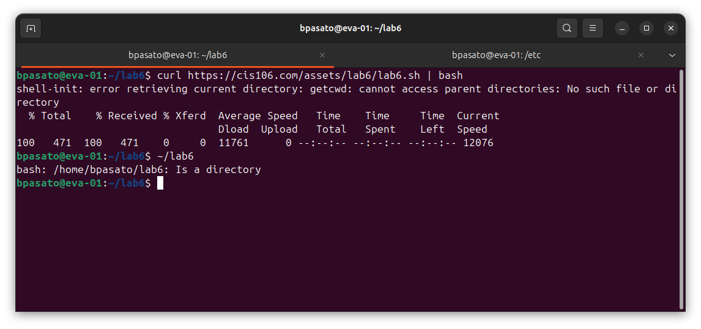
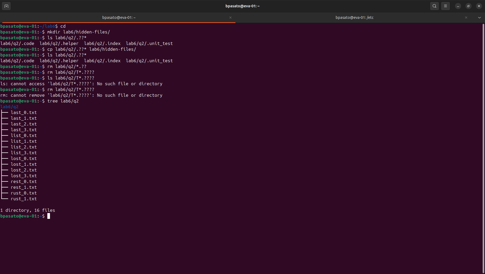
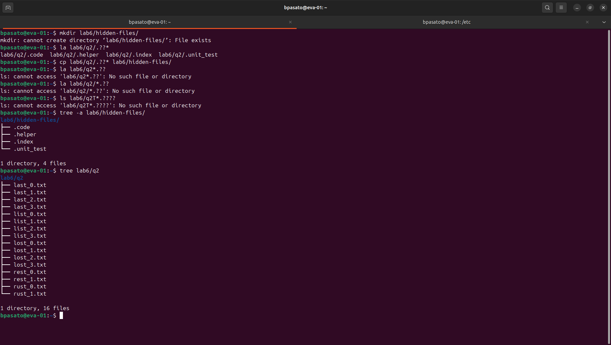

## Lab 6 Questions 

## Question 1

I had some trouble with this question because after I curled the link it shows up in my directory but it keeps saying there is not lab 6 in there but allowed me to pull info from q2 inside the folder in the other lab questions. 

## Question 2

## Question 3 

