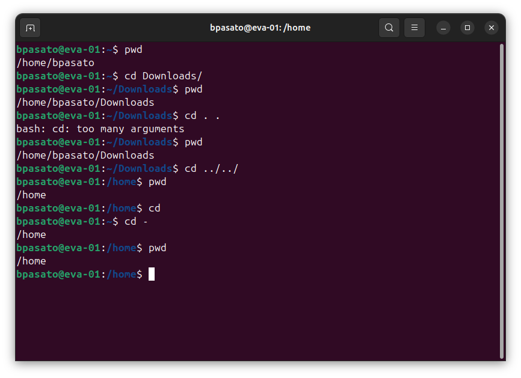
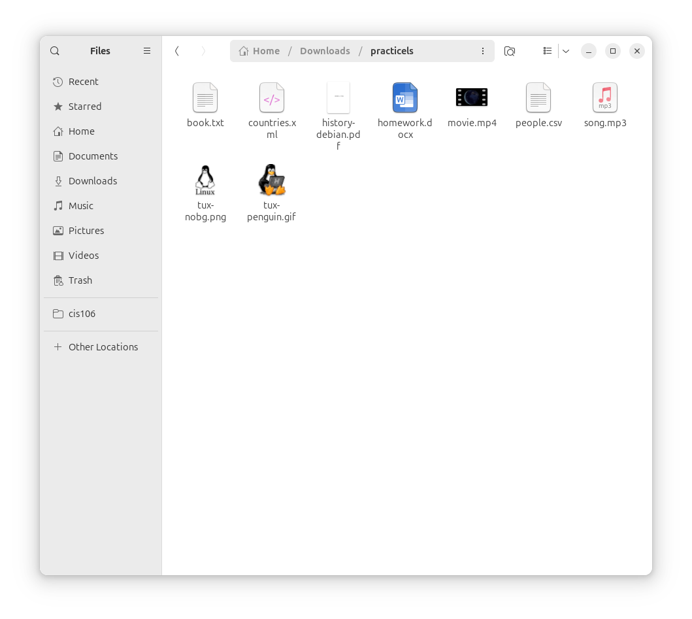
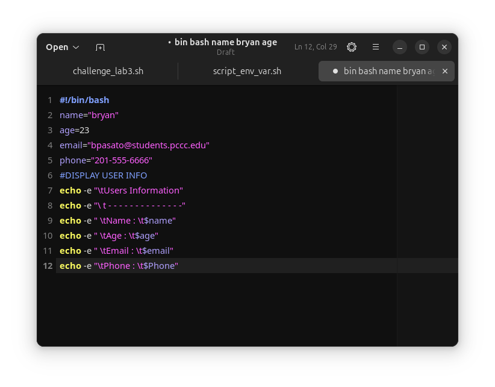

    # Week Report 4

## Practice 1 

## Practice 2

I downloaded the files and tried to use the commands but nothing was working

## Practice 3 

These are the scripts I created and when I saved them and tried to use the call command it still telling me there isn't one in the directory but I do have a Scripts folder in my home directory. I will understand you may take points off but I still wanted to show you that I am writing the scripts correctly. 

## Practice 4

